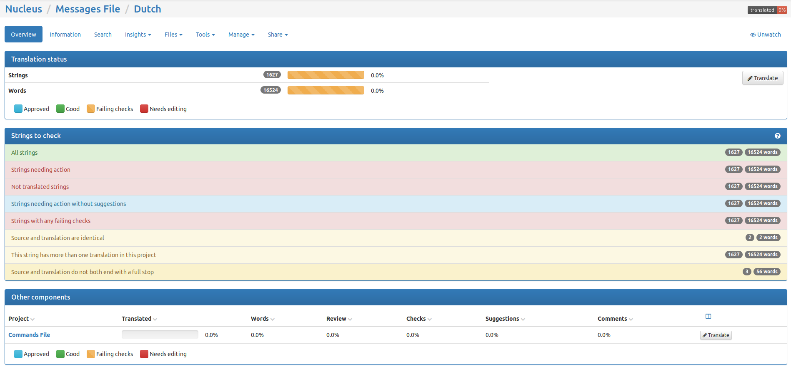
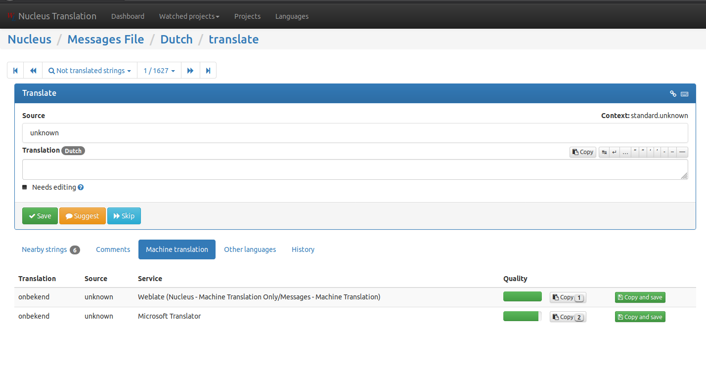
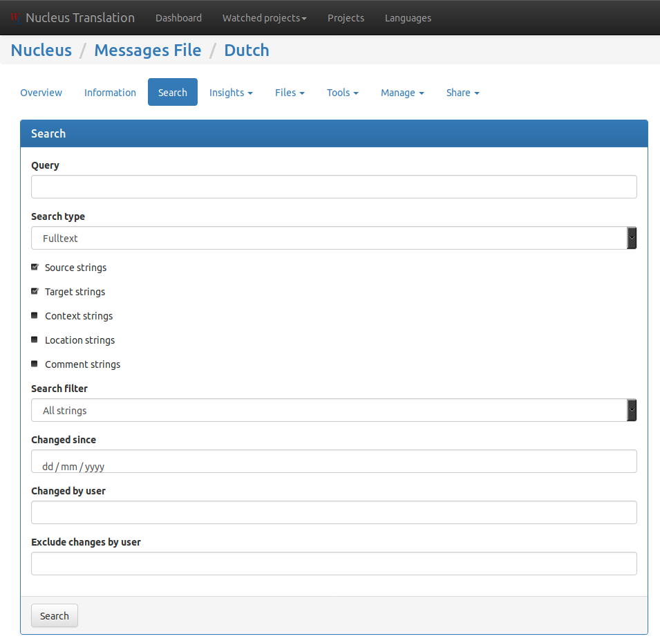

<a href="index.html">&laquo; Return to Documentation Home Page</a>

# Before you begin

Note that Nucleus Translation requires you to have a GitHub account. By using this service, your public name
as it is on GitHub and e-mail address is stored in the system. We may enable e-mail notifications at a later date.

# Translating Nucleus

There are two components to translate, the Commands file and the Messages file.

* The Commands file contains the descriptions of the commands, found when running `/commandname ?`.
* The Messages file contains all other translatable text.

Both need to be translated. You may see Machine Translation versions of these components, please do not touch
these as they are used to provide sample translations.

To translate either of these components, after signing in:

* Select Projects on the top bar
* Select "Nucleus"
* Select "Commands" or "Messages"
* Select your language
  * If the language you wish to translate isn't there, open a Github issue or put a message into the
    translation channel in Discord

You should be presented with a page that looks like the following:

## Translating text

In general, you will want to select "Strings needing action" under "Strings to Check". You'll end up in the
translation interface:

You may add your translation to the "Translation" box. You may also check to see if machine translations
have been provided, by clicking on the "Machine Translation" link below the translation interface. If the
translation looks correct, click "Copy and save" next to the translation and move on. If it's almost correct,
you may click "Copy" and make the edits that you need.

If you are unsure as to whether a translation you are contributing is correct, either mark it with "Needs Edit"
(if you just need a minor tweak) or "Suggest" (if you aren't sure and want someone to confirm it).

## Searching for specific text

If you are looking for a specific text to translate, you can search for the specific text by selecting "Search"
at the top of the page. You'll be presented with the following interface:

In the search interface, "source" is the English text, "target" is the target language. The result of the 
search will open a translation window that is linked to the search results.

